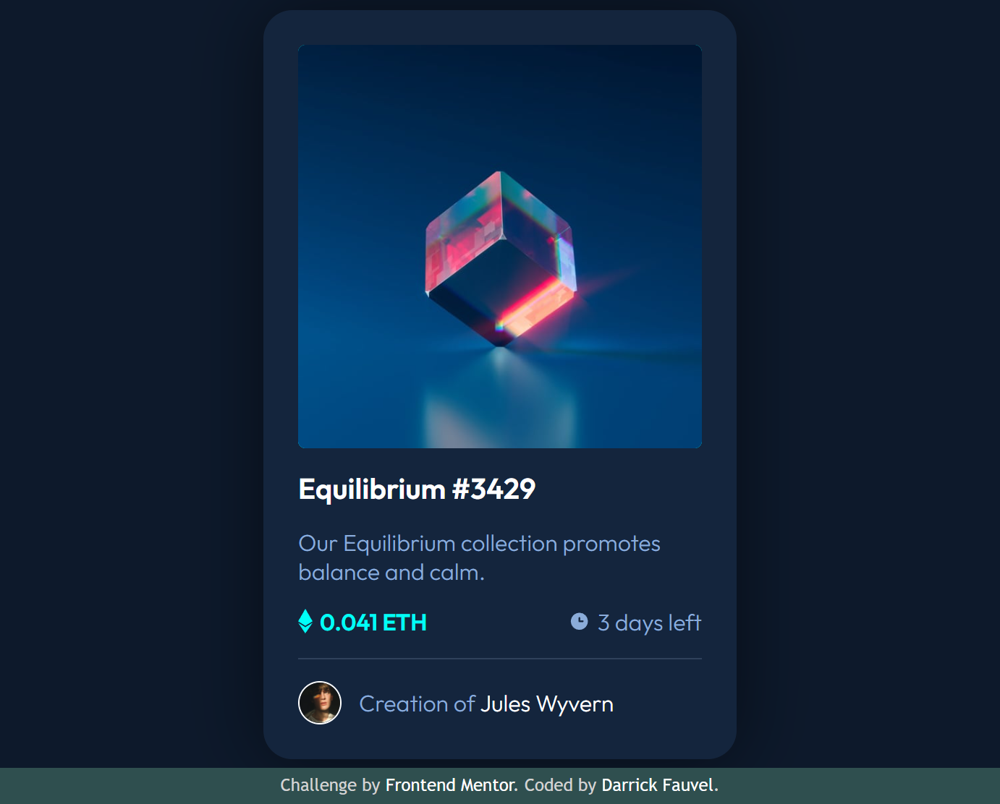

# Frontend Mentor - NFT preview card component solution

This is a solution to the [NFT preview card component challenge on Frontend Mentor](https://www.frontendmentor.io/challenges/nft-preview-card-component-SbdUL_w0U). Frontend Mentor challenges help you improve your coding skills by building realistic projects.

## Table of contents

- [Overview](#overview)
  - [The challenge](#the-challenge)
  - [Screenshot](#screenshot)
  - [Links](#links)
- [My process](#my-process)
  - [Built with](#built-with)
  - [What I learned](#what-i-learned)
  - [Continued development](#continued-development)
- [Author](#author)

## Overview

### The challenge

Users should be able to:

- View the optimal layout depending on their device's screen size
- See hover states for interactive elements

### Screenshot

### Links

- Solution URL: [https://www.frontendmentor.io/solutions/nft-preview-card-component-html-and-css-eRkDppP-t](https://www.frontendmentor.io/solutions/nft-preview-card-component-html-and-css-eRkDppP-t)
- Live Site URL: [https://darrickfauvel.github.io/fem02-nft-preview-card-component/](https://darrickfauvel.github.io/fem02-nft-preview-card-component/)

## My process

### Built with

- Semantic HTML5 markup
- CSS custom properties
- Flexbox
- CSS Grid
- Mobile-first workflow

### What I learned

It's challenging to fade a background color and icon over an image.

### Continued development

Around the corners of the image, there is some background color artifacting happening on the rounded edges. I'd like to find a solution to this issue.

## Author

- Website - [darrickfauvel.com](https://www.darrickfauvel.com)
- Frontend Mentor - [@DarrickFauvel](https://www.frontendmentor.io/profile/DarrickFauvel)
